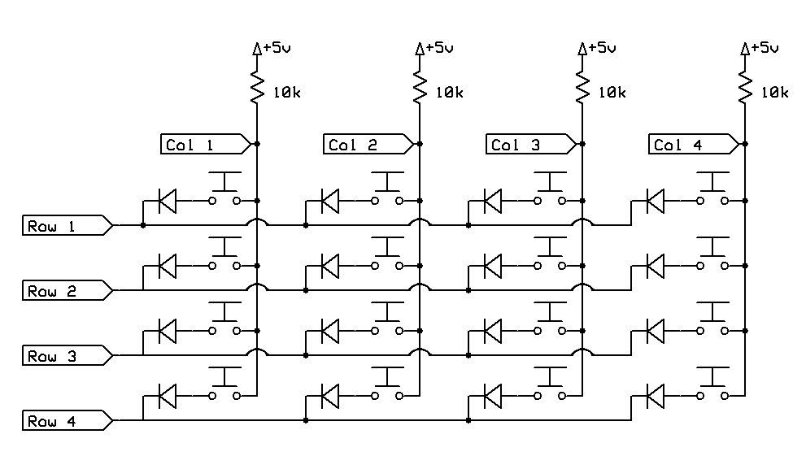

## Keypad Matrix library

This supports a keypad matrix as described [in this post](http://www.gammon.com.au/forum/?id=14175).

Example wiring for 4x4 matrix:



It supports n-key rollover (multiple keys pressed at once). To handle more than two keys pressed at once diodes (eg. 1N4148) are strongly recommend as shown in the above schematic. Without them you will get "ghost" key presses under certain circumstances (with 3 or more keys pressed at once).


### Example of use

```c++
  const byte ROWS = 4;
  const byte COLS = 4;

  // how the keypad has its keys laid out
  const char keys[ROWS][COLS] = {
    {'1', '2', '3', 'A'},
    {'4', '5', '6', 'B'},
    {'7', '8', '9', 'C'},
    {'*', '0', '#', 'D'},
  };

  const byte colPins[COLS] = {2, 3, 4, 5}; //connect to the column pinouts of the keypad
  const byte rowPins[ROWS] = {6, 7, 8, 9}; //connect to the row pinouts of the keypad

  // Create the Keypad (makeKeymap casts the keys array to const char *)
  Keypad_Matrix kpd = Keypad_Matrix (makeKeymap (keys), rowPins, colPins, ROWS, COLS );
```

In setup, call "begin" to allocate memory, and set a keydown and/or a keyup handler:

```c++
  void setup ()
    {
    kpd.begin ();
    kpd.setKeyDownHandler (keyDown);
    }
```

In loop, call "scan" to check the current key status:

```c++
  void loop()
    {
    kpd.scan ();
    }
```


The handlers return the keyvalue (from the "keys" array) corresponding to which key just went down or up. The handlers are
  called automatically for the appropriate keys during the call to "scan" above.

```c++
  void keyDown (const char which)
    {
    Serial.print (F("Key down: "));
    Serial.println (which);
    } // end of keyDown
```

You can also query if other keys are currently down (eg. for doing something like Ctrl+C)

```c++
  if (isKeyDown ('*'))
    {
    // do something
    }
```

### Custom handlers

The row handlers and read handler are intended to allow you to do your own reading of the columns. For example,
  you might use a 74HC165 to shift in 8 bits using SPI. You can omit those for conventional wiring to digital
  pins as default handlers are supplied.

The read handler is called once for each column (passed as an argument the column pin from the colPins array). The default
    behaviour is to do a digital read of that column. The read handler should return LOW (pressed) or HIGH (not pressed).

The start row handler is intended to prepare for reading the columns (for example, it might read the bits for each column in one operation). The default behaviour is to set that row to OUTPUT and LOW.

The end row handlers is intended to wrap up after a row. The default behaviour is to set that row back to INPUT mode.

For external hardware (like shift registers) you may want to pass "false" to enablePullups as that won't be relevant there.


### How to install

Just use the "clone or download" button to get a .zip file with all of the library files in it, and unzip that into your "libraries" folder inside your Arduino sketchbook folder.
